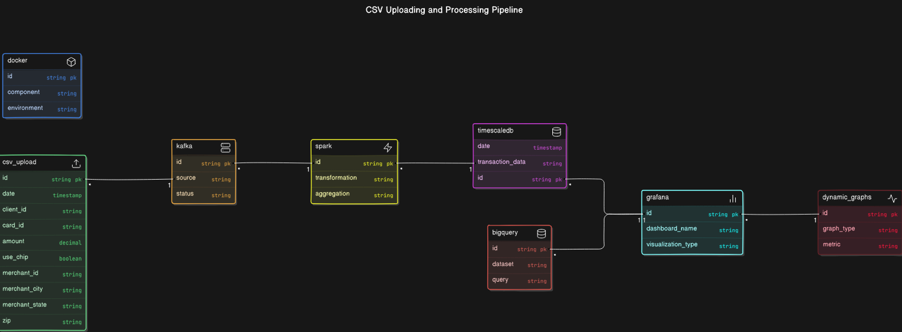

# Transaction Data Pipeline

## Overview

This project implements a real-time transaction data pipeline, ingesting financial transaction data, processing it using Spark, and storing it in a TimescaleDB database for analysis and visualization with Grafana. The pipeline leverages Kafka for message queuing, ensuring data durability and scalability.

## Architecture

The system comprises the following key components:

-   **Frontend:** A simple HTML interface ([`Frontend/index.html`](Frontend/index.html)) for uploading CSV files containing transaction data.
-   **Backend:** A Flask-based backend ([`Backend/backend.py`](Backend/backend.py)) that receives CSV uploads, parses the data, and publishes each transaction as a message to a Kafka topic.
-   **Kafka:** A distributed message streaming platform that acts as a central hub for transaction data.
-   **Consumer:** A Python application ([`consumer/consumer.py`](consumer/consumer.py)) that consumes transaction messages from Kafka and stores them in TimescaleDB.
-   **Spark Worker:** A Spark application ([`kafka-server/spark-worker.py`](kafka-server/spark-worker.py)) that reads transaction data from Kafka, performs transformations and enriches the data, and writes the processed data to TimescaleDB.
-   **TimescaleDB:** A time-series database built on PostgreSQL, used for storing and efficiently querying transaction data.
-   **Grafana:** A data visualization tool used to create dashboards and monitor the transaction data stored in TimescaleDB.

## Workflow

1.  **Data Ingestion:**
    -   The user uploads a CSV file containing transaction data through the frontend.
    -   The backend receives the CSV file, parses it using pandas, and serializes each transaction record into a JSON message.
    -   The backend publishes each JSON message to a Kafka topic named `financial_transactions`.
2.  **Data Processing:**
    -   The Spark worker subscribes to the `financial_transactions` Kafka topic.
    -   It reads the JSON messages, parses them according to a predefined schema, and performs data transformations, such as adding a processing timestamp and extracting the hour of day, day of the week and month from the transaction date.
    -   The processed data is then written to the TimescaleDB database.
3.  **Data Storage:**
    -   The consumer subscribes to the `financial_transactions` Kafka topic.
    -   It reads the JSON messages, parses them according to a predefined schema.
    -   The transaction data is stored in the `transactions` hypertable in TimescaleDB, optimized for time-series queries.
4.  **Data Visualization:**
    -   Grafana is configured to connect to the TimescaleDB database.
    -   Dashboards are created in Grafana to visualize the transaction data, providing insights into key metrics such as total transaction amount over time, top clients by total spend, and geographical distribution of transactions.

## Components

### Frontend

*   Dockerfile: [`Frontend/Dockerfile`](Frontend/Dockerfile)
*   index.html: [`Frontend/index.html`](Frontend/index.html)

### Backend

*   Dockerfile: [`Backend/Dockerfile`](Backend/Dockerfile)
*   backend.py: [`Backend/backend.py`](Backend/backend.py)
*   requirements.txt: [`Backend/requirements.txt`](Backend/requirements.txt)

### Kafka Server

*   Dockerfile: [`kafka-server/Dockerfile`](kafka-server/Dockerfile)
*   spark-worker.py: [`kafka-server/spark-worker.py`](kafka-server/spark-worker.py)
*   requirements.txt: [`kafka-server/requirements.txt`](kafka-server/requirements.txt)

### Consumer

*   Dockerfile: [`consumer/Dockerfile`](consumer/Dockerfile)
*   consumer.py: [`consumer/consumer.py`](consumer/consumer.py)
*   requirements.txt: [`consumer/requirements.txt`](consumer/requirements.txt)

### TimescaleDB

*   Dockerfile: [`Postgre/Dockerfile`](Postgre/Dockerfile)
*   init.sql: [`Postgre/init.sql`](Postgre/init.sql)
*   init-timescaledb.sh: [`Postgre/init-timescaledb.sh`](Postgre/init-timescaledb.sh)

## BigQuery Integration 

This pipeline can be extended to integrate with Google BigQuery for advanced analytics and large-scale data warehousing.  By streaming data from Kafka to BigQuery, you can leverage BigQuery's powerful query engine and scalability to perform complex analysis on historical transaction data.

**Use Cases for BigQuery:**

*   **Long-term trend analysis:** Analyze transaction patterns over extended periods, identifying seasonal trends and long-term growth opportunities.
*   **Advanced customer segmentation:** Combine transaction data with other customer data sources in BigQuery to create highly targeted customer segments for marketing and personalization.
*   **Fraud detection:**  Develop sophisticated fraud detection models by analyzing large volumes of transaction data and identifying anomalous patterns.
*   **Business intelligence and reporting:** Create comprehensive business intelligence dashboards and reports using BigQuery's integration with tools like Google Data Studio.

To implement BigQuery integration, you would typically use a tool like GCP to stream data 

### Grafana

*   grafana.ini: [`grafana/grafana.ini`](grafana/grafana.ini)
*   dashboard.json: [`grafana/dashboards/dashboard.json`](grafana/dashboards/dashboard.json)
*   dashboard.yaml: [`grafana/provisioning/dashboards/dashboard.yaml`](grafana/provisioning/dashboards/dashboard.yaml)

### Scripts

*   kafka\_producer.py: [`scripts/kafka_producer.py`](scripts/kafka_producer.py)
*   spark\_processor.py: [`scripts/spark_processor.py`](scripts/spark_processor.py)

### Docker Compose

*   docker-compose.yml: [`docker-compose.yml`](docker-compose.yml)

## Setup

1.  **Clone the repository:**

    ```bash
    git clone <repository_url>
    cd <repository_directory>
    ```

2.  **Start the services using Docker Compose:**

    ```bash
    docker-compose up -d
    ```

    This command builds and starts all the necessary services defined in the [`docker-compose.yml`](docker-compose.yml) file, including Kafka, TimescaleDB, Grafana, the backend, and the frontend.

3.  **Access the applications:**

    *   **Frontend:** Open your web browser and navigate to `http://localhost:3000` to access the frontend for uploading CSV files.
    *   **Grafana:** Access Grafana at `http://localhost:3001`. Log in with the default credentials (admin/admin). Configure the TimescaleDB data source and import the provided dashboard JSON file ([`grafana/dashboards/dashboard.json`](grafana/dashboards/dashboard.json)).

## Configuration

The configuration for each service is managed through environment variables defined in the [`docker-compose.yml`](docker-compose.yml) file. Key configuration parameters include:

*   **Kafka Broker:** `kafka:29092`
*   **TimescaleDB Host:** `timescaledb`
*   **TimescaleDB Database:** `financial_transactions`
*   **TimescaleDB User:** `admin`
*   **TimescaleDB Password:** `password`

## Architecture Diagram
# 
